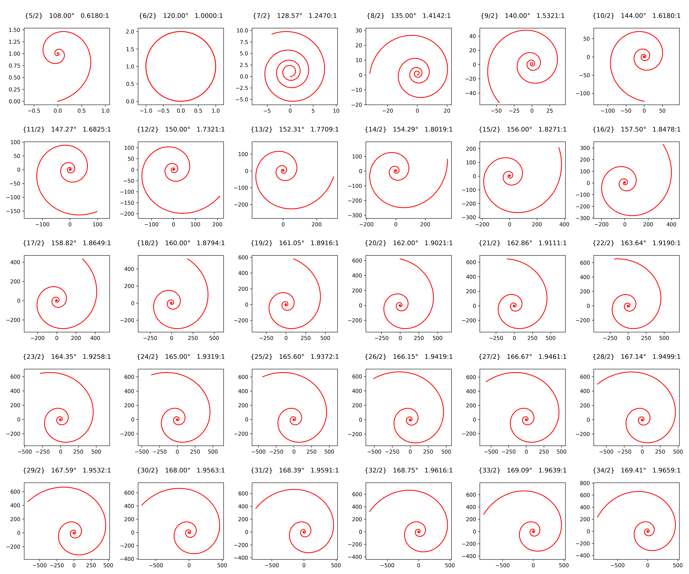

# Geometric analysis of line segment ratios and vertex angles in regular star polygons and the corresponding logarithmic spirals

This repository presents an in-depth geometric investigation into the properties and behaviors of regular star polygons (polygrams) and the corresponding logarithmic spirals. In this study, we focus on a family of star polygons constructed by connecting evenly spaced vertices on a circumferential circle with a fixed step, denoted as {_n_/2} stars, where _n_ is the total number of vertices.

## Abstract

The primary objective of this research is to investigate the geometric properties inherent within regular star polygons by analyzing the characteristic ratio found in each {_n_/2} configuration. By measuring the ratio between specific segments of these triangles, and calculating the angle between vertices, we uncover fundamental geometric properties that characterize each star polygon configuration.

This ratio is a critical metric in characterizing the polygon's geometry, with notable examples including:
- **Pentagram {5/2}:** Exhibits a ratio of 0.6180339887..., the golden ratio. This unique characteristic underpins a spiral projection that rotates in an opposite direction relative to spirals derived from ratios greater than unity.
- **Hexagram {6/2}:** Possesses a ratio exactly equal to 1, which results in the formation of a perfect circle instead of a conventional spiral, thus highlighting its exceptional symmetry.

## Methodology

- **Regular Star Polygon Construction:** For each configuration with n vertices (where n ≥ 5), vertices are positioned uniformly on a unit circle. The star polygon is synthesized by connecting vertices based on a fixed step of 2.
- **Ratio Computation:** Utilizing principles of Euclidean geometry, the methodology involves computing intersections of extended edges from adjacent vertices. These intersections enable the derivation of base and leg segments of isosceles triangles (or equilateral triangles for the hexagram) that compose the star tips, allowing for precise calculation of polygram ratios.
- **Logarithmic Spiral Generation:** For each star polygon configuration, a corresponding logarithmic spiral is constructed using the calculated ratio and the angle between vertices (180°-360°/n). The spiral's growth factor is determined by this ratio, with each successive arc segment (spanning the angle between vertices) scaled accordingly, resulting in either an expanding or contracting spiral based on whether the ratio is greater or less than unity.
- **Visualization:** The package leverages `matplotlib` to generate visual representations of both the regular star polygons and the corresponding logarithmic spirals. This visualization assists in verifying the computed geometric proportions and further substantiates the analytical framework.

## Visual Results


<sub>**Figure 1:** Regular star polygon series constructed using a fixed step of 2. _V_ denotes the number of vertices, _A_ denotes the angle, and _R_ denotes the ratio.</sub>


<sub>**Figure 2:** Logarithmic spiral series generated from regular star polygon ratios. _V_ denotes the number of vertices, _A_ denotes the angle, and _R_ denotes the ratio.</sub>

### Spiral Construction

Each spiral is constructed using two key parameters:
1. The angle between vertices (180°-360°/_n_)
2. The ratio derived from the line segment analysis of each {_n_/2} regular star polygon

Of particular significance in this series are:

- **Pentagram {5/2}:** Produces a unique inward-rotating true golden spiral with a ratio of approximately 0.6180339887... (the reciprocal of the golden ratio). This is the only configuration below _n_ = 6 that generates a rotating spiral opposite to those with ratios greater than unity.

- **Hexagram {6/2}:** Represents a critical threshold where the ratio equals exactly 1.0, resulting in a perfect circle rather than a spiral. This occurs because the scaling factor between successive segments becomes unity, maintaining constant radius.

- **Higher-order polygrams (_n_ > 6):** All exhibit ratios greater than 1.0, producing outward-rotating logarithmic spirals with increasingly rapid expansion rates as _n_ increases.

This progression demonstrates how the fundamental geometric properties of regular star polygons directly influence their corresponding spiral formations, with the pentagram and hexagram serving as unique threshold cases in the series.

## Conclusion

This study demonstrates that the geometric configurations of the pentagram and hexagram are distinct, and that logarithmic spirals exhibit exponential expansion as the number of vertices increases. In the pentagram, alignment with the golden ratio yields a spiral that rotates in the reverse direction relative to spirals with ratios greater than unity, whereas the hexagram's unit ratio results in a perfectly circular formation. Reciprocating golden ratios are observed in configurations with 5 and 10 vertices: the 5-vertex configuration produces a true golden spiral, while the 10-vertex configuration generates a logarithmic spiral with a growth factor equal to the golden ratio. However, the 10-vertex spiral features a 144° arc span compared to the 108° arc span of the pentagram's spiral, resulting in an imperfect golden spiral. Notably, the combination of the golden ratio with a 108° arc span is the only configuration that produces a perfect golden spiral. These distinct properties provide valuable insights into the underlying symmetries and mathematical beauty of regular star polygons, and they may inspire further research in advanced geometric analysis and natural pattern formation.

## Installation

Clone the repository:

```bash
git clone https://github.com/sahelars/polygrams-and-spirals.git
```

Navigate to the repository:

```bash
cd polygrams-and-spirals
```

Install the package:

```bash
pip3 install .
```

## Usage

To generate plots of star polygons:

```bash
python3 -m generate --polygrams [n]
```

To generate logarithmic spirals:

```bash
python3 -m generate --spirals [n]
```

Optional parameter [n] (defaulting to 30) determines the number of configurations

## License

This project is licensed under the MIT License. See the [LICENSE](LICENSE.md) file for further details.
